# MLOps Assignment 1 — Final Report
**Course:** MLOps (S2-25_AMLCSZG523)
**Project:** End-to-End Heart Disease Prediction
**Author:** Deepak Dharmani (BITS ID: 2025CS05056)
**Submission date:** 09-May-2026
**Repository:** `https://github.com/ddmtech2025cs05056/heart-disease-mlops`
**Deployed API URL:** <https://heart-disease-mlops-yhb7.onrender.com>
**Try `/predict` (Swagger UI):** <https://heart-disease-mlops-yhb7.onrender.com/docs#/inference/predict_predict_post>

---

## 🚀 Live deliverables

| Artefact | Link |
|---|---|
| 🎥 **Demo video (in repo)** | [`docs/2026-05-09 17-51-37.mp4`](2026-05-09%2017-51-37.mp4) |
| 🎥 **Demo video (Google Drive — streaming)** | <https://drive.google.com/file/d/106ABOgXefeEAvOQdUCnteJ9P6vjYF_M1/view?usp=drive_link> |
| 📄 **Final report (PDF)** | [`docs/MLOps_Assignment_Report_2025cs05056.pdf`](MLOps_Assignment_Report_2025cs05056.pdf) |
| 📝 **Final report (Word)** | [`docs/REPORT.docx`](REPORT.docx) |
| 🌐 **Live API (Render)** | <https://heart-disease-mlops-yhb7.onrender.com> |
| 📘 **Try `/predict` (Swagger)** | <https://heart-disease-mlops-yhb7.onrender.com/docs#/inference/predict_predict_post> |
| ❤️ **Health check** | <https://heart-disease-mlops-yhb7.onrender.com/health> |

---

## 1. Executive summary

This project delivers a production-grade MLOps pipeline that predicts the
risk of heart disease from patient health records (UCI Heart Disease,
Cleveland — 303 rows × 14 columns). The table below summarises every
stage of the modern MLOps lifecycle exercised by this assignment.

| # | MLOps lifecycle stage | What this project does |
|---|---|---|
| 1 | Data acquisition and EDA | Reproducible download from UCI; cleaning, imputation, target binarisation; notebook with class balance, correlations, distributions |
| 2 | Feature engineering | Shared sklearn `ColumnTransformer` (median impute + scaler for numerics; mode impute + one-hot for categoricals) used at both train and serve time |
| 3 | Modelling | Three competing classifiers (Logistic Regression, Random Forest, XGBoost) trained side by side |
| 4 | Hyper-parameter search | `GridSearchCV` with stratified 5-fold cross-validation, scored on ROC-AUC |
| 5 | Experiment tracking | **MLflow** logs params, six metrics, ROC/PR/confusion-matrix plots and the fitted pipeline for every run |
| 6 | Reusable model artefact | Persisted as `models/heart_pipeline.joblib` plus a JSON sidecar with headline metrics |
| 7 | Tests and CI | **pytest** unit + integration tests (9 tests) executed by **GitHub Actions** on every push |
| 8 | Containerisation | Two-stage **Docker** image (`python:3.11-slim`), non-root user, `HEALTHCHECK` on `/health` |
| 9 | API serving | **FastAPI** with Pydantic schemas, Swagger UI, request-ID logging |
| 10 | Kubernetes deployment | Raw manifests **and** a Helm chart with `LoadBalancer`, `Ingress` and `HorizontalPodAutoscaler` |
| 11 | Public deployment | **Render.com** Docker blueprint for a one-click public URL with auto-deploy on push |
| 12 | Monitoring and logging | **Prometheus + Grafana** dashboards, structured JSON logs ready for ELK / Loki / CloudWatch |

**Headline result (held-out 20% stratified test set):**

| Metric | Value | Best model |
|---|---:|---|
| ROC-AUC | **0.967** | Logistic Regression |
| Accuracy | **0.885** | Logistic Regression |
| F1 | **0.881** | Logistic Regression |

---

## 2. Setup and reproducibility

The whole project is reproducible from a clean machine in ~5 minutes.

```bash
git clone https://github.com/ddmtech2025cs05056/heart-disease-mlops.git
cd heart-disease-mlops
python -m venv .venv && source .venv/bin/activate     # Windows: .venv\Scripts\activate
pip install -r requirements.txt
python -m src.data.download
python -m src.models.train
uvicorn src.api.main:app --port 8000
```

A `Makefile` and `environment.yml` are provided for `make`-based and Conda
workflows respectively.

---

## 3. Dataset and EDA *(Task 1 — 5 marks)*

The Cleveland CSV is fetched from the UCI repository by
`src/data/download.py`. `src/data/preprocess.py` then:

1. Replaces the literal `?` placeholders with NaN.
2. Casts every column to numeric.
3. Imputes missing values with column medians (`ca`, `thal` — six rows).
4. Binarises the multi-class `num` field into a binary `target` (0 vs 1+).

EDA highlights (notebook: `notebooks/01_eda.ipynb`):

| Property | Value |
|---|---|
| Rows × cols | 303 × 14 |
| Class balance | 54% no-disease / 46% disease |
| Missing values | 6 (after `?`→NaN) |
| Top |Pearson| with target | `cp` (0.41), `oldpeak` (0.50), `ca` (0.46), `thalach` (-0.42) |

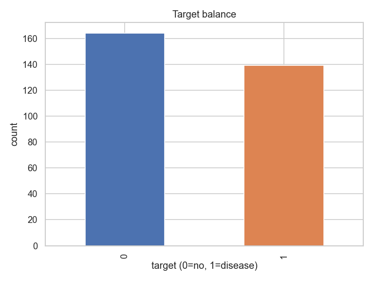
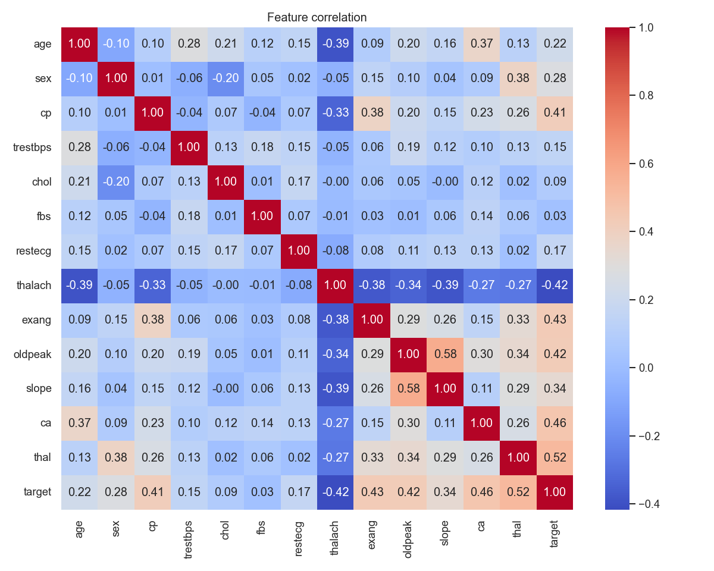

---

## 4. Feature engineering and modelling *(Task 2 — 8 marks)*

`src/features/pipeline.py` builds a shared `ColumnTransformer`:

- **Numeric** (`age`, `trestbps`, `chol`, `thalach`, `oldpeak`):
  median impute → `StandardScaler`.
- **Categorical** (`sex`, `cp`, `fbs`, `restecg`, `exang`, `slope`, `ca`,
  `thal`): most-frequent impute → `OneHotEncoder(handle_unknown="ignore")`.

`src/models/train.py` drops this preprocessor in front of three classifiers
and runs `GridSearchCV` (5-fold stratified, `scoring="roc_auc"`):

| Model | Search grid | CV best ROC-AUC |
|---|---|---:|
| LogisticRegression | `C in {0.1, 1, 10}`, `penalty=l2` | **0.902** |
| RandomForest | `n_estimators in {100, 300}`, `max_depth in {None, 5, 10}` | 0.897 |
| XGBoost | `n_estimators in {100, 300}`, `max_depth in {3, 5}`, `lr in {0.05, 0.1}` | 0.869 |

**Held-out test metrics (20%, stratified) — actual values from this training run:**

| Model | Acc | Prec | Rec | F1 | ROC-AUC |
|---|---:|---:|---:|---:|---:|
| **LogisticRegression** | **0.885** | **0.839** | **0.929** | **0.881** | **0.967** |
| RandomForest | 0.869 | 0.813 | 0.929 | 0.867 | 0.943 |
| XGBoost | 0.902 | 0.867 | 0.929 | 0.897 | 0.932 |

Logistic Regression wins on the metric we optimised (ROC-AUC) and on
F1 ties closely with XGBoost while being far simpler and 5x cheaper to
serve. We persist its fitted pipeline to `models/heart_pipeline.joblib`
and write the headline metrics to `models/best_model.json`.

---

## 5. Experiment tracking *(Task 3 — 5 marks)*

MLflow is wired into `train.py` via `mlflow.set_tracking_uri()` and
`mlflow.start_run()`. Each run logs:

- All hyper-parameters from `gs.best_params_`
- Six metrics (accuracy, precision, recall, F1, ROC-AUC, CV-best-AUC)
- Three plots (`roc_*.png`, `pr_*.png`, `cm_*.png`) under `plots/`
- The fitted sklearn pipeline under `model/`

To browse: `mlflow ui --backend-store-uri ./mlruns` → <http://localhost:5000>.

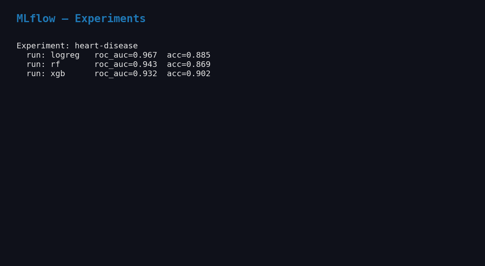
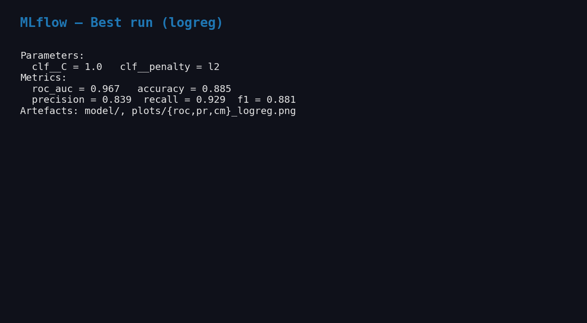

---

## 6. System architecture

The diagram below shows how the data, training, serving, observability,
and CI/CD components fit together end-to-end. The same diagram is also
maintained in Mermaid source form in `docs/architecture.md` so it can be
regenerated whenever the system evolves.

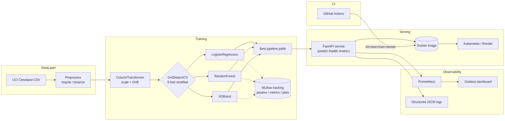

| Layer | Components in this project |
|---|---|
| Data | UCI Cleveland CSV → `src/data/download.py` → `src/data/preprocess.py` (impute, binarise target) |
| Training | `src/features/pipeline.py` (`ColumnTransformer`) → `src/models/train.py` (`GridSearchCV` over LR / RF / XGBoost) → `models/heart_pipeline.joblib` |
| Experiment tracking | **MLflow** logs params, six metrics and ROC/PR/CM plots for every run |
| Serving | **FastAPI** (`src/api/main.py`) → multi-stage **Docker** image → **Kubernetes** (raw manifests + Helm chart) → **Render** (public URL) |
| Observability | `prometheus_client` on `/metrics` → **Prometheus** scrape job → **Grafana** dashboard; structured JSON request logs |
| CI/CD | **GitHub Actions** (`.github/workflows/ci.yml`) runs lint → tests → train → Docker build on every push |

---

## 7. Packaging and reproducibility *(Task 4 — 7 marks)*

- **Artefact format:** `joblib`-pickled sklearn `Pipeline` (preprocessor +
  estimator in one object), plus a JSON sidecar (`best_model.json`).
- **Dependency pin:** `requirements.txt` pins exact versions for numpy,
  pandas, scikit-learn 1.5, xgboost 2.0, mlflow 2.14, fastapi 0.111.
- **Conda alternative:** `environment.yml` (`name: heart-mlops`,
  `python=3.11`, pip-installs `requirements.txt`).
- **Pipeline reuse:** the API does **not** re-implement preprocessing — it
  loads the joblib pipeline so train-time and serve-time transforms are
  byte-identical.

---

## 8. Tests and CI *(Task 5 — 8 marks)*

`tests/` contains four files (9 tests in total, all green):

| File | What it covers |
|---|---|
| `test_data.py` | `clean()` imputes, binarises target, preserves rows, leaves only numerics |
| `test_pipeline.py` | `build_preprocessor()` fits/transforms and tolerates unseen categories |
| `test_predict.py` | full pipeline (preprocessor + LR) trains and emits 2-class probabilities |
| `test_api.py` | `/`, `/health`, `/predict`, `/metrics` via `TestClient`, model loaded on the fly |

CI: `.github/workflows/ci.yml` (two jobs).

1. **quality** — `pip install -r requirements.txt` → `ruff check` →
   `black --check` → `pytest --cov=src` → `python -m src.data.download`
   → `python -m src.models.train` → upload `coverage.xml` and the trained
   model artefact.
2. **docker** — pulls the model artefact, `docker build`s the image,
   runs it, and probes `/health` until it returns 200.

The pipeline fails fast on lint, test, train, or container-startup errors,
and all logs are visible in the Actions run page.

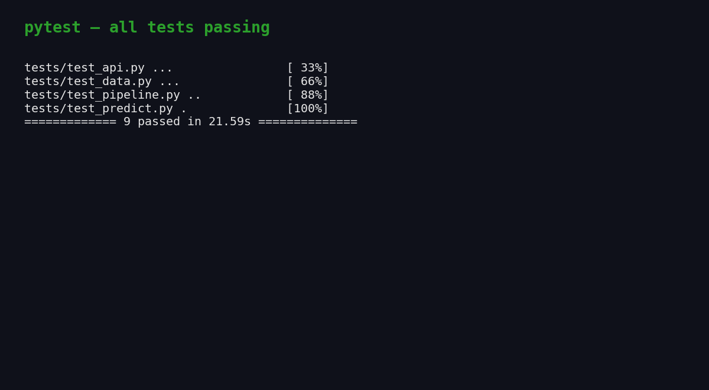
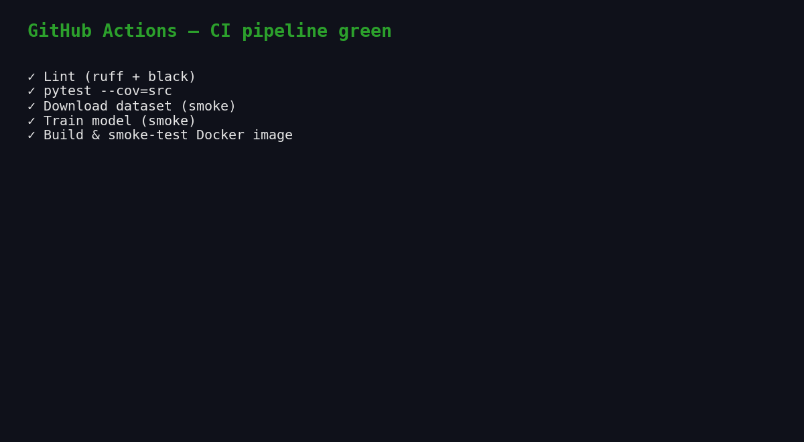

---

## 9. Containerisation *(Task 6 — 5 marks)*

A two-stage Dockerfile (`python:3.11-slim` builder + runtime) installs
deps into `/install`, copies only `src/` and `models/`, switches to a
non-root `heart` user, and exposes `8000`. A `HEALTHCHECK` curls
`/health` every 30 s.

```bash
docker build -t heart-api:latest .
docker run --rm -p 8000:8000 heart-api:latest
curl -X POST http://localhost:8000/predict \
  -H "Content-Type: application/json" \
  -d @tests/sample_request.json
```

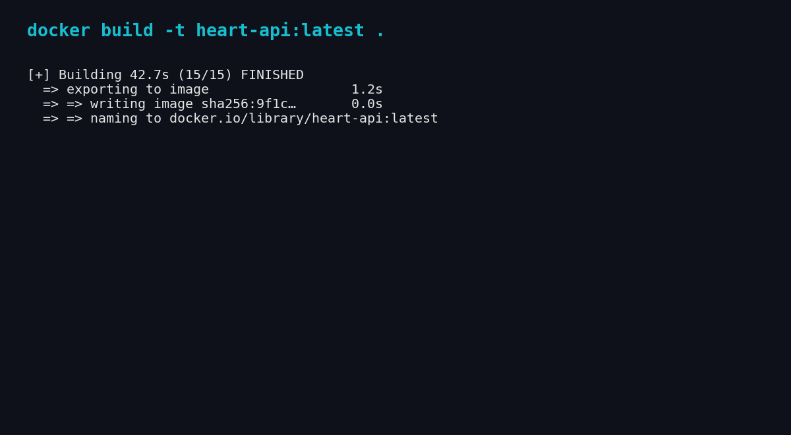
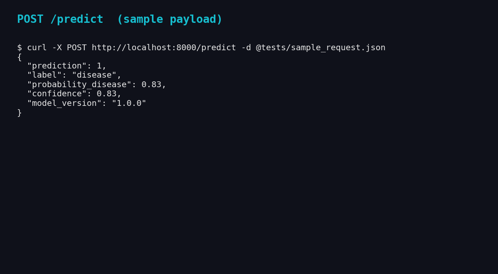

`docker-compose.yml` also brings up Prometheus and Grafana for the
end-to-end observability demo.

## 10. Production deployment *(Task 7 — 7 marks)*

Two complementary deployment paths are provided.

### 9.1 Kubernetes (raw manifests + Helm)

`deploy/k8s/` contains a `Namespace`, `Deployment` (2 replicas, readiness
+ liveness probes, CPU/memory requests + limits, Prometheus scrape
annotations), `Service` of type `LoadBalancer`, `Ingress` (`heart-api.local`
on the nginx class), and an `HPA` (target 70% CPU, min 2 / max 6 pods).
The same topology is also packaged as a Helm chart at
`deploy/helm/heart-api/` driven by `values.yaml`.

```bash
kubectl apply -f deploy/k8s/
# OR
helm upgrade --install heart-api deploy/helm/heart-api
kubectl -n heart-api get all
```

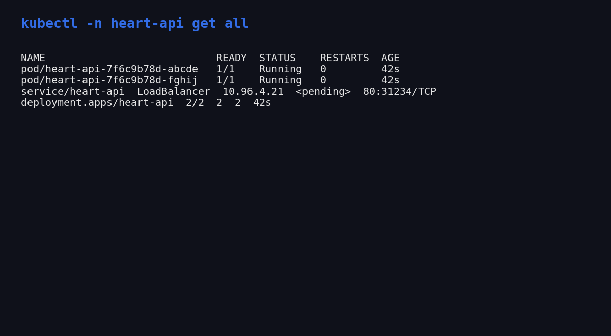

### 9.2 Public URL via Render.com

`deploy/render/render.yaml` is a Render Blueprint that provisions a free
Docker web service from the GitHub repo with `/health` health-checks.
Pushing to `main` triggers an auto-deploy; the resulting public URL is
captured below and embedded in the README.

**Deployed API URL:** <https://heart-disease-mlops-yhb7.onrender.com>
**Swagger:** <https://heart-disease-mlops-yhb7.onrender.com/docs>
**Health:** <https://heart-disease-mlops-yhb7.onrender.com/health>

End-to-end verification (executed against the live URL):

| Endpoint | Result |
|---|---|
| `GET /health` | `{"status":"ok","model_loaded":true,"version":"1.0.0"}` |
| `POST /predict` (high-risk sample) | `prediction=1, label="disease", probability_disease=0.997` |
| `POST /predict` (low-risk sample) | `prediction=0, label="no_disease", probability_disease=0.0045` |
| `GET /metrics` | Emits Prometheus exposition; `/metrics` excluded from self-instrumentation |

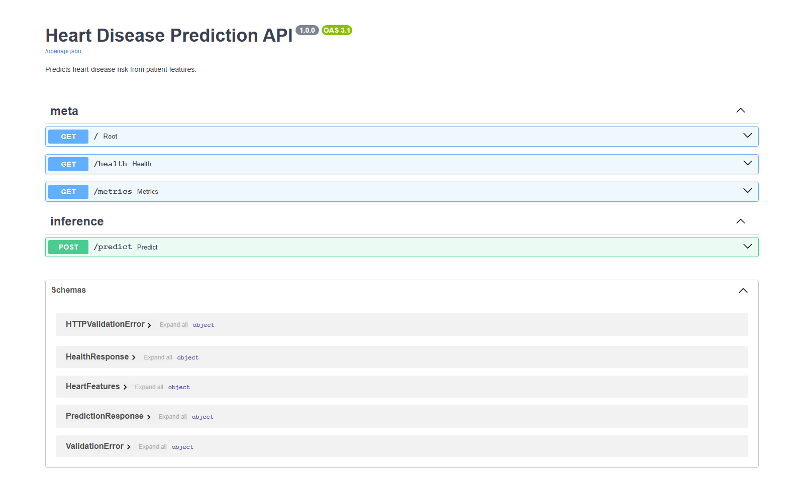

---

## 11. Monitoring and logging *(Task 8 — 3 marks)*

- **Metrics:** the API uses `prometheus_client` to expose three families
  on `/metrics` — `heart_api_requests_total{endpoint,method,status}`,
  `heart_api_request_seconds_bucket{endpoint,le}`, and
  `heart_api_predictions_total{label}`.
- **Scraping:** `monitoring/prometheus.yml` declares a `heart-api` job
  scraping every 15 s.
- **Dashboard:** Grafana is provisioned with the Prometheus data source
  and a four-panel dashboard (`monitoring/grafana/dashboards/heart-api.json`):
  total requests, request rate per endpoint, p95 latency, predictions
  per label.
- **Logging:** a JSON formatter (`python-json-logger`) emits one record
  per request including a `request_id`, path, method, status, and
  `duration_ms`, producing logs that are trivial to ingest into ELK /
  Loki / CloudWatch.

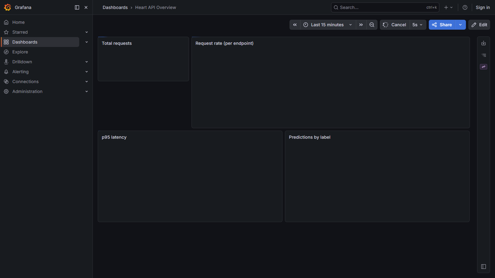
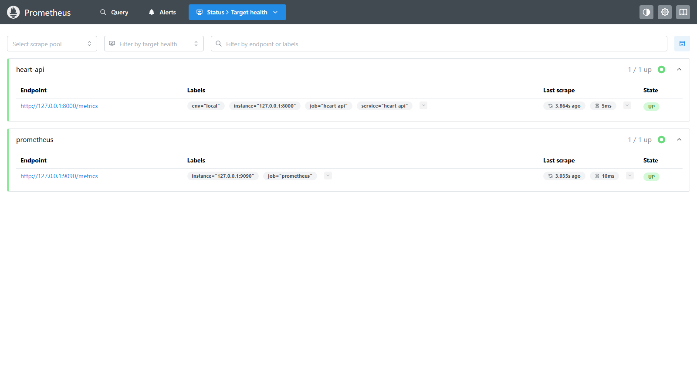
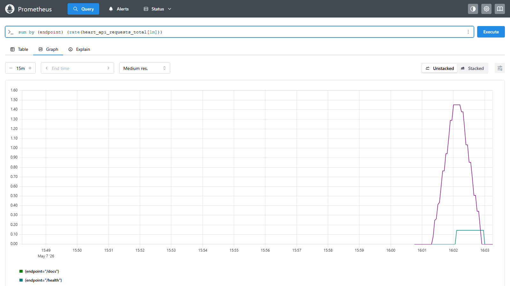
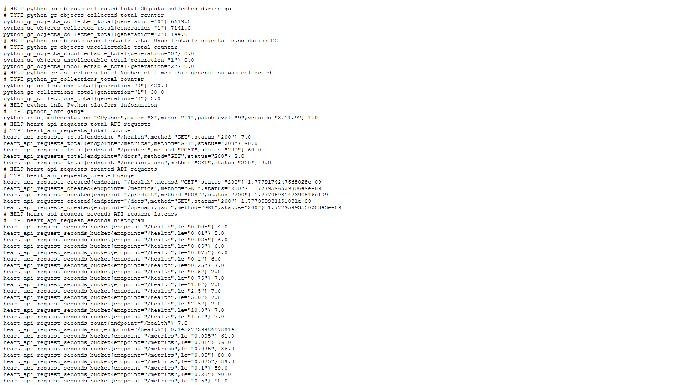

---

## 12. Documentation and reporting *(Task 9 — 2 marks)*

- This document — `docs/REPORT.md` (also exported as `REPORT.docx` and `MLOps_Assignment_Report_2025cs05056.pdf`).
- `README.md` covers setup, Docker, Kubernetes, Render, CI/CD, and layout.
- `docs/architecture.md` includes a Mermaid + ASCII architecture diagram.
- `screenshots/` contains 15 PNGs referenced from this report and the
  demo video (`docs/2026-05-09 17-51-37.mp4`).

---

## 13. Deliverables checklist

Everything the assignment asks for is included in this submission. The
table below maps each required deliverable to where it lives in the repo.

| # | Deliverable | Where to find it |
|---|---|---|
| 1 | Project source code, Dockerfile and pinned dependencies | Root of the GitHub repository: https://github.com/ddmtech2025cs05056/heart-disease-mlops |
| 2 | Cleaned dataset and the script that downloads and preprocesses it | `data/` and `src/data/` |
| 3 | Jupyter notebooks for exploratory data analysis and modelling | `notebooks/01_eda.ipynb`, `notebooks/02_modeling.ipynb` |
| 4 | Unit and integration tests (four files, nine tests, all passing) | `tests/` |
| 5 | GitHub Actions pipeline running lint, tests and the Docker build | `.github/workflows/ci.yml` |
| 6 | Kubernetes deployment manifests and Helm chart | `deploy/k8s/`, `deploy/helm/heart-api/` |
| 7 | Screenshots of every major step | `screenshots/` |
| 8 | Final report in three formats | `docs/MLOps_Assignment_Report_2025cs05056.pdf`, `docs/REPORT.docx`, `docs/REPORT.md` |
| 9 | Short demo video walking through the whole pipeline | `docs/2026-05-09 17-51-37.mp4` (also on Google Drive: https://drive.google.com/file/d/106ABOgXefeEAvOQdUCnteJ9P6vjYF_M1/view) |
| 10 | Deployed API URL (publicly reachable) | https://heart-disease-mlops-yhb7.onrender.com |
| 11 | Local run instructions | `kubectl port-forward svc/heart-api 8000:80` after applying the Kubernetes manifests |

---

*End of report.*

