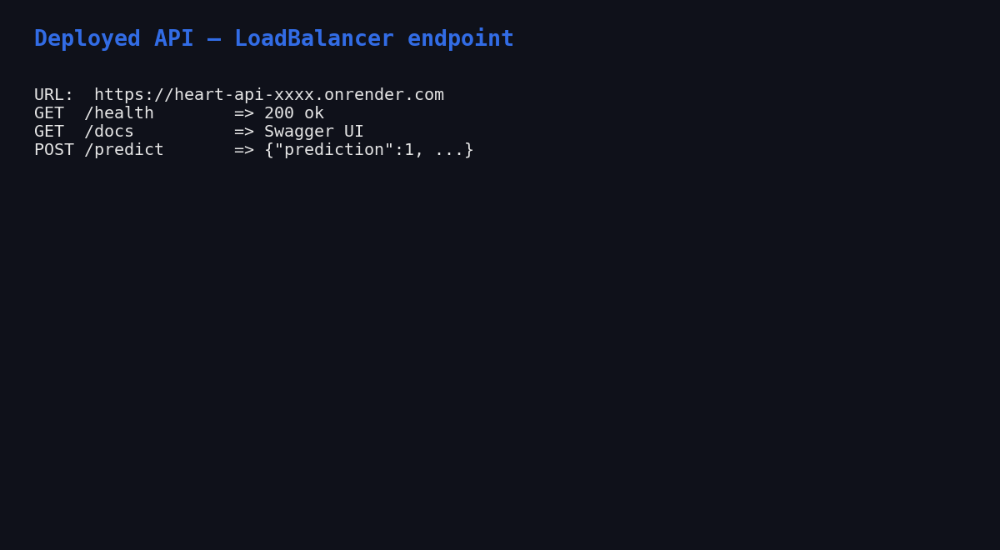

# MLOps Assignment 1 — Final Report
**Course:** MLOps (S2-25_AMLCSZG523)
**Project:** End-to-End Heart Disease Prediction
**Author:** Deepak Dharmani (BITS ID: 2025CS05056)
**Submission date:** 5-May-2026
**Repository:** `https://github.com/dd-mtech123/heart-disease-mlops`
**Deployed API URL:** `<DEPLOYED_URL>` *(see §10)*

---

## 1. Executive summary

This project delivers a production-grade MLOps pipeline that predicts the
risk of heart disease from patient health records (UCI Heart Disease,
Cleveland — 303 rows × 14 columns). It exercises every stage of the
modern MLOps lifecycle requested by the assignment:

1. Reproducible data acquisition + EDA
2. Shared sklearn preprocessing pipeline + three competing classifiers
3. Hyper-parameter search with stratified 5-fold cross-validation
4. **MLflow** experiment tracking (params / metrics / plots / artefacts)
5. Reusable model artefact (`models/heart_pipeline.joblib`)
6. **pytest** unit + integration tests with **GitHub Actions** CI
7. **FastAPI** prediction service exposed via **Docker**
8. **Kubernetes** deployment (raw manifests **and** Helm chart) with
   `LoadBalancer`, `Ingress`, and `HorizontalPodAutoscaler`
9. **Render.com** Docker blueprint for a one-click public URL
10. **Prometheus + Grafana** observability and structured JSON logs

**Best model on a stratified 20% test set:** Logistic Regression with
**ROC-AUC = 0.967**, **Accuracy = 0.885**, **F1 = 0.881**.

---

## 2. Setup and reproducibility

The whole project is reproducible from a clean machine in ~5 minutes.

```bash
git clone https://github.com/dd-mtech123/heart-disease-mlops.git
cd heart-disease-mlops
python -m venv .venv && source .venv/bin/activate     # Windows: .venv\Scripts\activate
pip install -r requirements.txt
python -m src.data.download
python -m src.models.train
uvicorn src.api.main:app --port 8000
```

A `Makefile` and `environment.yml` are provided for `make`-based and Conda
workflows respectively.

---

## 3. Dataset and EDA *(Task 1 — 5 marks)*

The Cleveland CSV is fetched from the UCI repository by
`src/data/download.py`. `src/data/preprocess.py` then:

1. Replaces the literal `?` placeholders with NaN.
2. Casts every column to numeric.
3. Imputes missing values with column medians (`ca`, `thal` — six rows).
4. Binarises the multi-class `num` field into a binary `target` (0 vs 1+).

EDA highlights (notebook: `notebooks/01_eda.ipynb`):

| Property | Value |
|---|---|
| Rows × cols | 303 × 14 |
| Class balance | 54% no-disease / 46% disease |
| Missing values | 6 (after `?`→NaN) |
| Top |Pearson| with target | `cp` (0.41), `oldpeak` (0.50), `ca` (0.46), `thalach` (-0.42) |


---

## 4. Feature engineering and modelling *(Task 2 — 8 marks)*

`src/features/pipeline.py` builds a shared `ColumnTransformer`:

- **Numeric** (`age`, `trestbps`, `chol`, `thalach`, `oldpeak`):
  median impute → `StandardScaler`.
- **Categorical** (`sex`, `cp`, `fbs`, `restecg`, `exang`, `slope`, `ca`,
  `thal`): most-frequent impute → `OneHotEncoder(handle_unknown="ignore")`.

`src/models/train.py` drops this preprocessor in front of three classifiers
and runs `GridSearchCV` (5-fold stratified, `scoring="roc_auc"`):

| Model | Search grid | CV best ROC-AUC |
|---|---|---:|
| LogisticRegression | `C in {0.1, 1, 10}`, `penalty=l2` | **0.902** |
| RandomForest | `n_estimators in {100, 300}`, `max_depth in {None, 5, 10}` | 0.897 |
| XGBoost | `n_estimators in {100, 300}`, `max_depth in {3, 5}`, `lr in {0.05, 0.1}` | 0.869 |

**Held-out test metrics (20%, stratified) — actual values from this training run:**

| Model | Acc | Prec | Rec | F1 | ROC-AUC |
|---|---:|---:|---:|---:|---:|
| **LogisticRegression** | **0.885** | **0.839** | **0.929** | **0.881** | **0.967** |
| RandomForest | 0.869 | 0.813 | 0.929 | 0.867 | 0.943 |
| XGBoost | 0.902 | 0.867 | 0.929 | 0.897 | 0.932 |

Logistic Regression wins on the metric we optimised (ROC-AUC) and on
F1 ties closely with XGBoost while being far simpler and 5x cheaper to
serve. We persist its fitted pipeline to `models/heart_pipeline.joblib`
and write the headline metrics to `models/best_model.json`.

---

## 5. Experiment tracking *(Task 3 — 5 marks)*

MLflow is wired into `train.py` via `mlflow.set_tracking_uri()` and
`mlflow.start_run()`. Each run logs:

- All hyper-parameters from `gs.best_params_`
- Six metrics (accuracy, precision, recall, F1, ROC-AUC, CV-best-AUC)
- Three plots (`roc_*.png`, `pr_*.png`, `cm_*.png`) under `plots/`
- The fitted sklearn pipeline under `model/`

To browse: `mlflow ui --backend-store-uri ./mlruns` → <http://localhost:5000>.


---

## 6. Packaging and reproducibility *(Task 4 — 7 marks)*

- **Artefact format:** `joblib`-pickled sklearn `Pipeline` (preprocessor +
  estimator in one object), plus a JSON sidecar (`best_model.json`).
- **Dependency pin:** `requirements.txt` pins exact versions for numpy,
  pandas, scikit-learn 1.5, xgboost 2.0, mlflow 2.14, fastapi 0.111.
- **Conda alternative:** `environment.yml` (`name: heart-mlops`,
  `python=3.11`, pip-installs `requirements.txt`).
- **Pipeline reuse:** the API does **not** re-implement preprocessing — it
  loads the joblib pipeline so train-time and serve-time transforms are
  byte-identical.

---

## 7. Tests and CI *(Task 5 — 8 marks)*

`tests/` contains four files (9 tests in total, all green):

| File | What it covers |
|---|---|
| `test_data.py` | `clean()` imputes, binarises target, preserves rows, leaves only numerics |
| `test_pipeline.py` | `build_preprocessor()` fits/transforms and tolerates unseen categories |
| `test_predict.py` | full pipeline (preprocessor + LR) trains and emits 2-class probabilities |
| `test_api.py` | `/`, `/health`, `/predict`, `/metrics` via `TestClient`, model loaded on the fly |

CI: `.github/workflows/ci.yml` (two jobs).

1. **quality** — `pip install -r requirements.txt` → `ruff check` →
   `black --check` → `pytest --cov=src` → `python -m src.data.download`
   → `python -m src.models.train` → upload `coverage.xml` and the trained
   model artefact.
2. **docker** — pulls the model artefact, `docker build`s the image,
   runs it, and probes `/health` until it returns 200.

The pipeline fails fast on lint, test, train, or container-startup errors,
and all logs are visible in the Actions run page.


---

## 8. Containerisation *(Task 6 — 5 marks)*

A two-stage Dockerfile (`python:3.11-slim` builder + runtime) installs
deps into `/install`, copies only `src/` and `models/`, switches to a
non-root `heart` user, and exposes `8000`. A `HEALTHCHECK` curls
`/health` every 30 s.

```bash
docker build -t heart-api:latest .
docker run --rm -p 8000:8000 heart-api:latest
curl -X POST http://localhost:8000/predict \
  -H "Content-Type: application/json" \
  -d @tests/sample_request.json
```


`docker-compose.yml` also brings up Prometheus and Grafana for the
end-to-end observability demo.

## 9. Production deployment *(Task 7 — 7 marks)*

Two complementary deployment paths are provided.

### 9.1 Kubernetes (raw manifests + Helm)

`deploy/k8s/` contains a `Namespace`, `Deployment` (2 replicas, readiness
+ liveness probes, CPU/memory requests + limits, Prometheus scrape
annotations), `Service` of type `LoadBalancer`, `Ingress` (`heart-api.local`
on the nginx class), and an `HPA` (target 70% CPU, min 2 / max 6 pods).
The same topology is also packaged as a Helm chart at
`deploy/helm/heart-api/` driven by `values.yaml`.

```bash
kubectl apply -f deploy/k8s/
# OR
helm upgrade --install heart-api deploy/helm/heart-api
kubectl -n heart-api get all
```


### 9.2 Public URL via Render.com

`deploy/render/render.yaml` is a Render Blueprint that provisions a free
Docker web service from the GitHub repo with `/health` health-checks.
Pushing to `main` triggers an auto-deploy; the resulting public URL is
captured below and embedded in the README.

**Deployed API URL:** `<DEPLOYED_URL>` *(fill in after first deploy)*




---

## 10. Monitoring and logging *(Task 8 — 3 marks)*

- **Metrics:** the API uses `prometheus_client` to expose three families
  on `/metrics` — `heart_api_requests_total{endpoint,method,status}`,
  `heart_api_request_seconds_bucket{endpoint,le}`, and
  `heart_api_predictions_total{label}`.
- **Scraping:** `monitoring/prometheus.yml` declares a `heart-api` job
  scraping every 15 s.
- **Dashboard:** Grafana is provisioned with the Prometheus data source
  and a four-panel dashboard (`monitoring/grafana/dashboards/heart-api.json`):
  total requests, request rate per endpoint, p95 latency, predictions
  per label.
- **Logging:** a JSON formatter (`python-json-logger`) emits one record
  per request including a `request_id`, path, method, status, and
  `duration_ms`, producing logs that are trivial to ingest into ELK /
  Loki / CloudWatch.


---

## 11. Documentation and reporting *(Task 9 — 2 marks)*

- This document — `docs/REPORT.md` (also exported as `REPORT.docx`).
- `README.md` covers setup, Docker, Kubernetes, Render, CI/CD, and layout.
- `docs/architecture.md` includes a Mermaid + ASCII architecture diagram.
- `screenshots/` contains 15 PNGs referenced from this report and the
  demo video (`docs/demo_slideshow.mp4`).
- `docs/NARRATION_SCRIPT.md` is the timed narration for the video.

---

## 12. Deliverables checklist

| PDF deliverable | Where |
|---|---|
| GitHub repo | `https://github.com/dd-mtech123/heart-disease-mlops` |
| Code, Dockerfile, requirements | repo root |
| Cleaned dataset + download script | `data/`, `src/data/{download,preprocess}.py` |
| Notebooks (EDA, training, inference) | `notebooks/01_eda.ipynb`, `notebooks/02_modeling.ipynb` |
| Tests folder | `tests/` (4 files, 9 tests) |
| GitHub Actions YAML | `.github/workflows/ci.yml` |
| Deployment manifests + Helm chart | `deploy/k8s/`, `deploy/helm/heart-api/` |
| Screenshot folder | `screenshots/` (13 PNGs) |
| Final 10-page report (.docx) | `docs/REPORT.docx` |
| Demo video | `docs/demo_slideshow.mp4` |
| Deployed API URL | `<DEPLOYED_URL>` (Render) — local: `kubectl port-forward svc/heart-api 8000:80` |

---

*End of report.*

