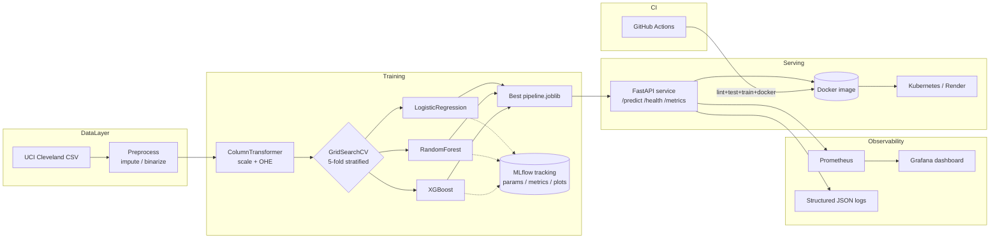

# Architecture

## Data flow

1. `src/data/download.py` pulls the Cleveland CSV from the UCI ML repository.
2. `src/data/preprocess.py` replaces `?` placeholders, casts to numeric,
   imputes medians, and binarizes the multi-class target (`num >= 1`).
3. `src/features/pipeline.py` builds a `ColumnTransformer` (median impute +
   `StandardScaler` for numerics; most-frequent impute + `OneHotEncoder`
   for categoricals).
4. `src/models/train.py` runs stratified 5-fold `GridSearchCV` over Logistic
   Regression, Random Forest, and XGBoost, scored by ROC-AUC. Each run logs
   parameters, six metrics (accuracy, precision, recall, F1, ROC-AUC,
   CV-best-AUC), three plots (ROC, PR, confusion matrix), and the model
   itself to MLflow. The winning estimator is also persisted as
   `models/heart_pipeline.joblib`.
5. `src/api/main.py` serves the persisted pipeline via FastAPI. The image
   is built from a multi-stage Dockerfile and deployed either via raw K8s
   manifests, a Helm chart, or Render's `render.yaml` blueprint.
6. Every request increments `prometheus_client` counters/histograms which
   are scraped by Prometheus and visualised in the auto-provisioned
   Grafana dashboard.
